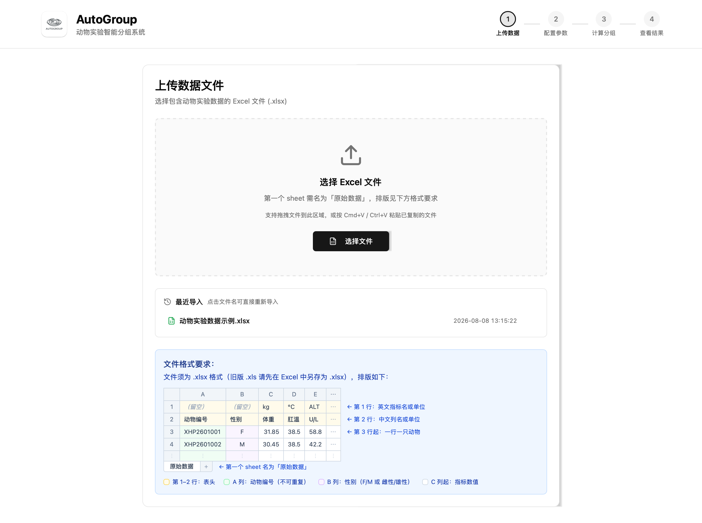
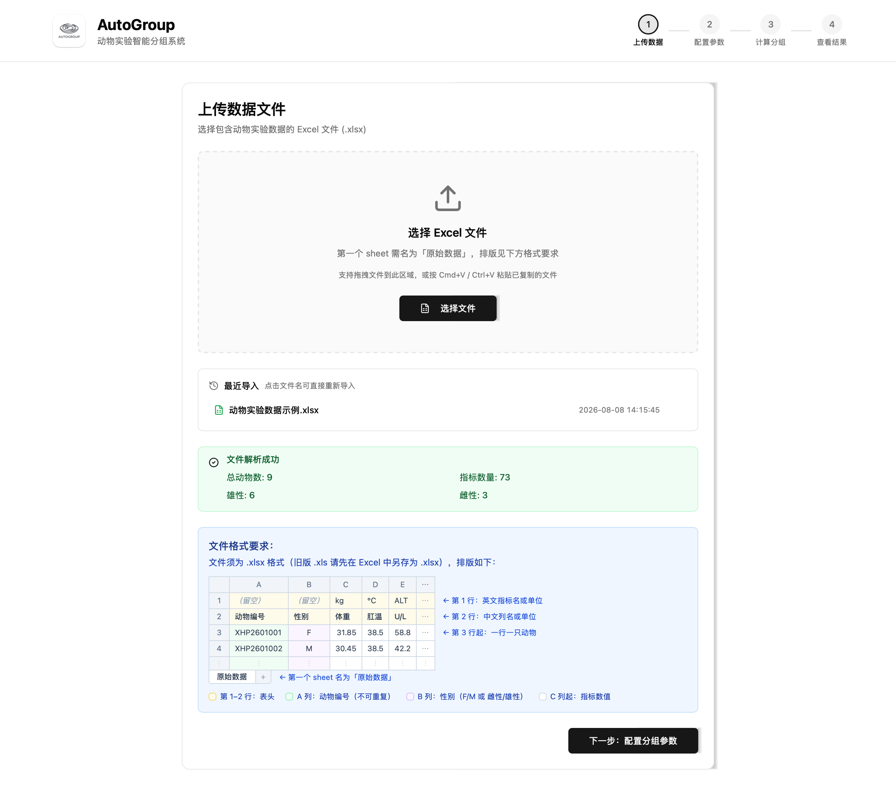
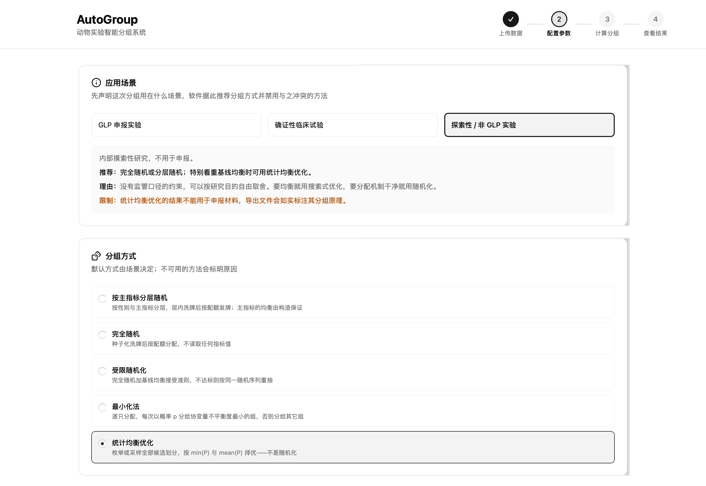
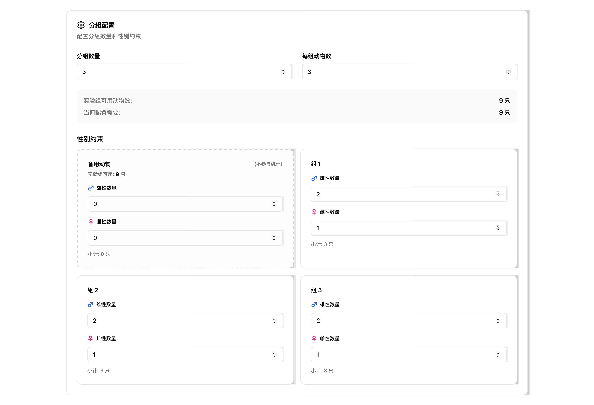
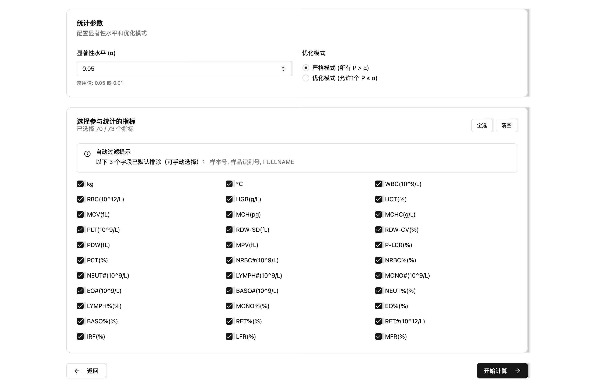
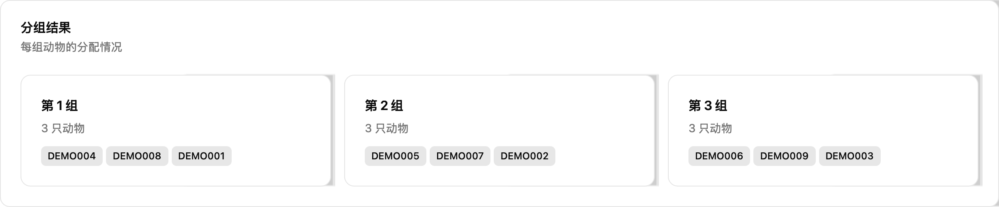
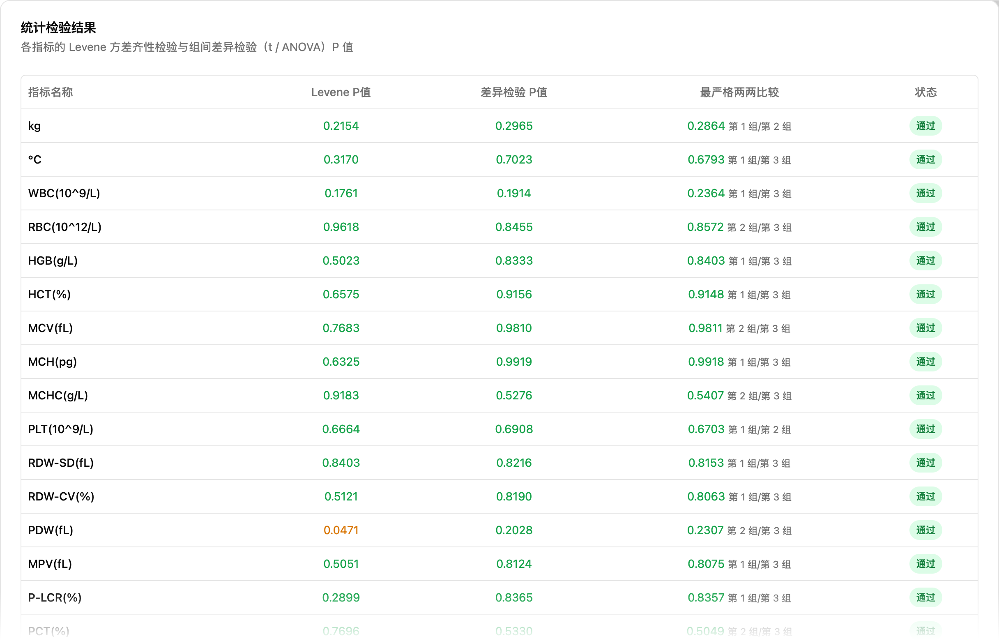
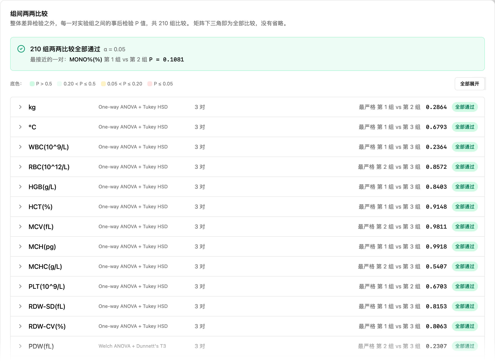
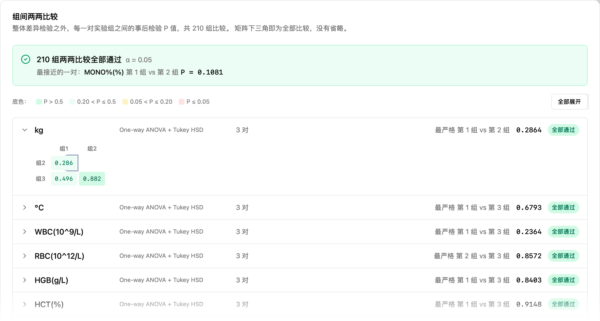

# AutoGroup 使用指南

AutoGroup 是一款实验动物自动分组的桌面软件。导入动物基线数据后，软件按所选方法（随机化或统计均衡优化）给出分组方案，并对每个指标做组间均衡性检验，最后导出可供审计与复现的 Excel 报告。

本指南面向用软件做分组的实验人员，按软件的四个步骤展开。截图基于 v0.1.6 开发版，界面细节可能随版本略有差异。

## 整体流程

软件顶部的步骤条对应四个阶段：

1. 上传数据：导入包含动物编号、性别和各项指标的 Excel 文件。
2. 配置参数：声明应用场景，选择分组方式，设置组数、性别配额和统计参数。
3. 计算分组：软件执行随机化或均衡优化，通常几秒内完成。
4. 查看结果：核对分组名单和各指标的检验结果，导出 Excel 报告。

## 准备数据文件

文件须为 `.xlsx` 格式（旧版 `.xls` 请先在 Excel 中另存为 `.xlsx`），第一个工作表须命名为「原始数据」，排版要求：

| 位置 | 内容 |
|------|------|
| 第 1 行 | 英文指标名或单位（A、B 两列留空） |
| 第 2 行 | 中文列名或单位（A 列「动物编号」、B 列「性别」） |
| 第 3 行起 | 一行一只动物 |

- A 列：动物编号，不可重复。
- B 列：性别，填 `F`/`M` 或「雌性」/「雄性」。
- C 列起：各项指标数值。

上传页内置了同样的格式示意，导入失败时可对照逐项检查。

## 第一步：上传数据

导入有三种方式，任选其一：

- 点击「选择文件」，在对话框中选取 Excel 文件；
- 把文件拖进虚线区域；
- 在访达 / 资源管理器中复制文件，回到本页按 `Cmd+V`（Windows 为 `Ctrl+V`）粘贴。

成功导入过的文件会出现在「最近导入」列表中，下次点击文件名即可直接重新导入。

解析成功后，页面显示总动物数、雄雌数量和指标数量。确认与预期一致后，点击「下一步：配置分组参数」。

若解析失败，页面会给出具体原因。常见原因：工作表名不是「原始数据」、表头行缺失、动物编号重复、性别列出现无法识别的取值。

## 第二步：配置参数

### 应用场景与分组方式

先声明这次分组用在什么场景：GLP 申报实验、确证性临床试验，还是探索性 / 非 GLP 实验。场景决定可用的分组方式：软件会推荐合适的方法，与该场景监管口径冲突的方法会被禁用，原因直接标注在选项上。

五种分组方式：

| 方式 | 机制 |
|------|------|
| 按主指标分层随机 | 按性别与主指标分层，层内洗牌后按配额发牌；主指标的均衡由构造保证 |
| 完全随机 | 种子化洗牌后按配额分配，不读取任何指标值 |
| 受限随机化 | 完全随机加基线均衡接受准则，不达标则按同一随机序列重抽 |
| 最小化法 | 逐只分配，每次以概率 p 分给使协变量不平衡度最小的组 |
| 统计均衡优化 | 枚举或采样全部候选划分，按 min(P) 与 mean(P) 择优，不属于随机化 |

选择随机化方法时会出现「随机种子」输入框：留空则自动生成；种子会随结果一并记录并写入导出文件，用于日后复现同一次分配。统计均衡优化不需要用户提供种子。

> 注意：统计均衡优化的结果不能用于申报材料，导出文件会如实标注其分组原理。

### 分组配置

设置分组数量和每组动物数，页面实时显示「实验组可用动物数」与「当前配置需要」的数量对比。

「性别约束」区域为每个组设置雄性 / 雌性配额。修改组数或每组动物数后配额会自动重新分配，也可以逐组手动调整。

备用动物是一个特殊分组：留作补充替换的动物放在这里，不参与统计检验，也不计入分组数量。配置需要的动物数少于可用数时，页面会提示把剩余动物设为备用。

### 统计参数与指标选择

- 显著性水平 (α)：常用 0.05 或 0.01。
- 优化模式二选一。严格模式要求所有参与指标的 P 值都大于 α；优化模式允许至多 1 个指标 P ≤ α，在此前提下依次最大化 min(P) 与 mean(P)。

「选择参与统计的指标」列出全部已解析指标。文本类字段（如样本号、FULLNAME）已默认排除，需要时可手动勾选；也可用「全选」「清空」批量操作。至少选择一个指标才能开始计算。

确认无误后点击「开始计算」。

## 第三步：计算分组

计算页显示本次使用的全部参数，供最后核对。计算耗时取决于数据量和分组配置，小规模数据（几十只动物）通常在几秒内完成；完成后自动跳转到结果页。

若提示「计算失败」，多数是当前约束下不存在满足条件的方案，参见文末「常见问题」。

## 第四步：查看结果

### 结果概览

顶部四个卡片汇总本次计算：总动物数、分组数量、合格指标数（P > α 的指标 / 参与指标）和计算耗时。

### 候选分组

统计均衡优化会返回 Top-N 个候选方案，按 min(P) 与 mean(P) 降序排列。点击任一候选即可切换下方所有结果视图。导出时用的就是当前选中的这个候选。

### 分组方法与可追溯性

记录本次分组声明的应用场景与实际使用的分组方式（随机化方法还会显示种子等信息）。同样的内容会写入导出文件的「汇总信息」表，供审计与复现使用。

### 分组结果

按组列出每只动物的编号，用于核对名单。

### 统计检验结果

每个指标一行，列含义：

| 列 | 含义 |
|----|------|
| Levene P 值 | 方差齐性检验的 P 值，决定后续用哪种差异检验 |
| 差异检验 P 值 | 组间差异检验（两组用 t 检验，三组及以上用 ANOVA）的 P 值 |
| 最严格两两比较 | 事后检验中 P 值最小的一对组及其 P 值 |
| 状态 | 该指标是否通过（P > α） |

检验方法由软件自动选择：方差齐时用 Student t 检验 / 普通 ANOVA + Tukey HSD，方差不齐时用 Welch t 检验 / Welch ANOVA + Dunnett T3。

### 组间两两比较

三组及以上设计在整体检验之外，还给出每一对实验组之间的事后检验 P 值，全部配对都会列出。顶部横幅汇总是否全部通过，并标出最接近显著的一对。

点击任一指标行可展开完整的两两比较矩阵，底色按 P 值分档，便于快速定位偏低的比较：

两组设计没有事后比较环节，此区域不显示。

### 导出结果

点击右下角「导出结果」，选择保存位置（默认文件名 `grouping_result.xlsx`）。导出的工作簿包含：

| 工作表 | 内容 |
|--------|------|
| 分组结果 | 一行一只动物，双行表头（单位 + 列名），每个实验组后附「均值±标准差」行 |
| 统计结果 | 每个指标的 Levene P、差异检验 P、检验方法与结论 |
| 事后比较 | 每对组每个指标一行的事后检验 P 值（两组设计无此表） |
| 汇总信息 | 应用场景、分组方式、参数与耗时等，供审计与复现 |

随机化方法的导出会额外包含审计列：「随机数」记录每只动物的抽签值；按主指标分层随机还会有「区组」列。审阅者在 Excel 中按区组和随机数重新排序，即可手工复核每只动物的组别分配；配合记录的种子，可以完整复现该次分配。

底部的「返回修改配置」保留数据回到第二步，「重新开始」清空全部状态回到第一步。

## 常见问题

**导入时提示解析失败。**
按上传页的「文件格式要求」逐项检查：文件是否为 `.xlsx`、第一个工作表是否名为「原始数据」、前两行表头是否完整、动物编号是否重复、性别列取值是否为 `F`/`M` 或「雌性」/「雄性」。

**提示找不到有效分组（计算失败）。**
严格模式要求所有指标 P > α，个别离群动物可能让任何划分都无法全部通过。可依次尝试：改用优化模式（允许 1 个指标不达标）、减少参与统计的指标、把可疑动物移入备用组。

**分组数量 × 每组动物数与总数对不上。**
实验组需要的动物数不能超过可用总数；有剩余动物时，建议将其设为备用动物，而不是留在实验组配额之外。

**如何复现一次历史分组？**
随机化方法：用导出文件「汇总信息」中记录的种子，以相同数据和配置重新计算。统计均衡优化：结果由数据和配置唯一决定，相同输入重算即可得到相同结果。
